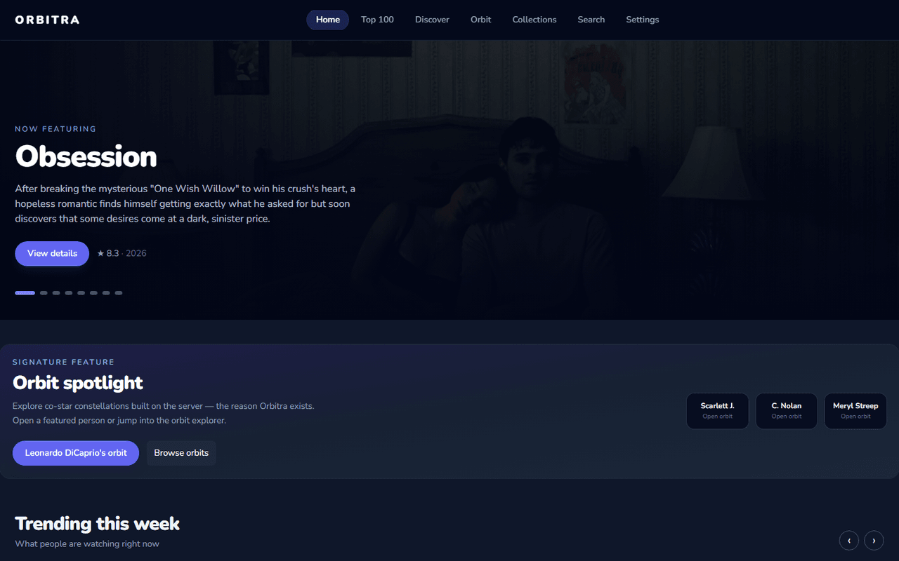
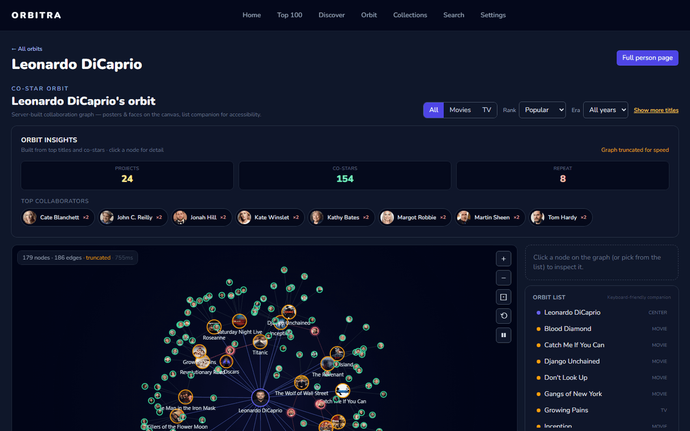
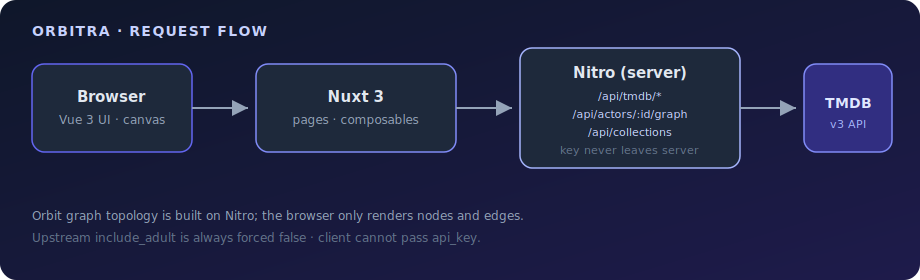
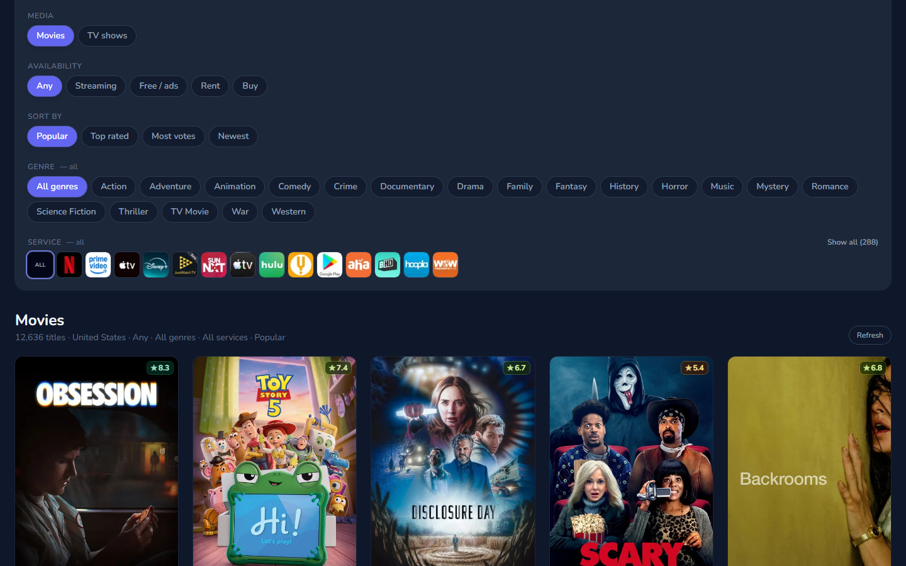
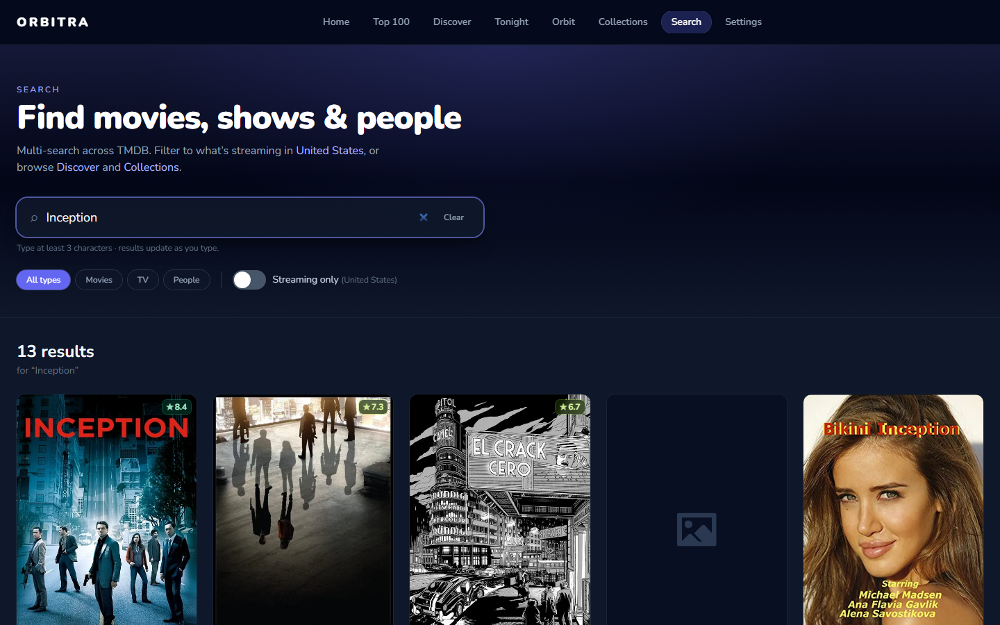
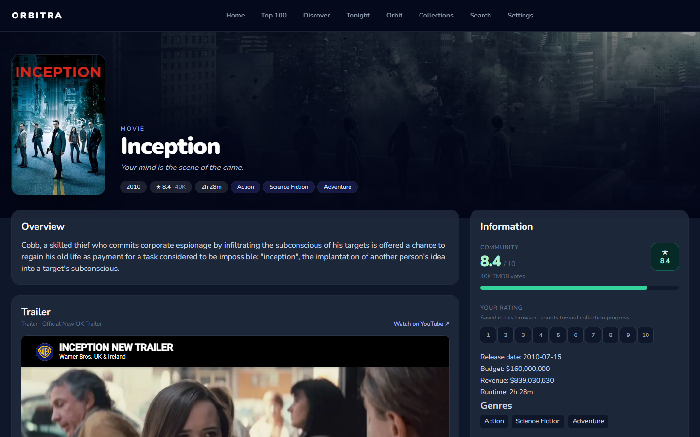
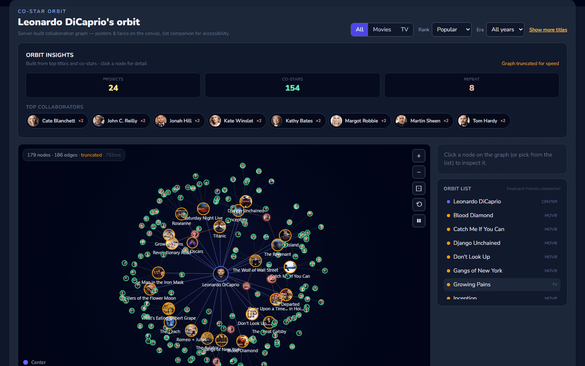
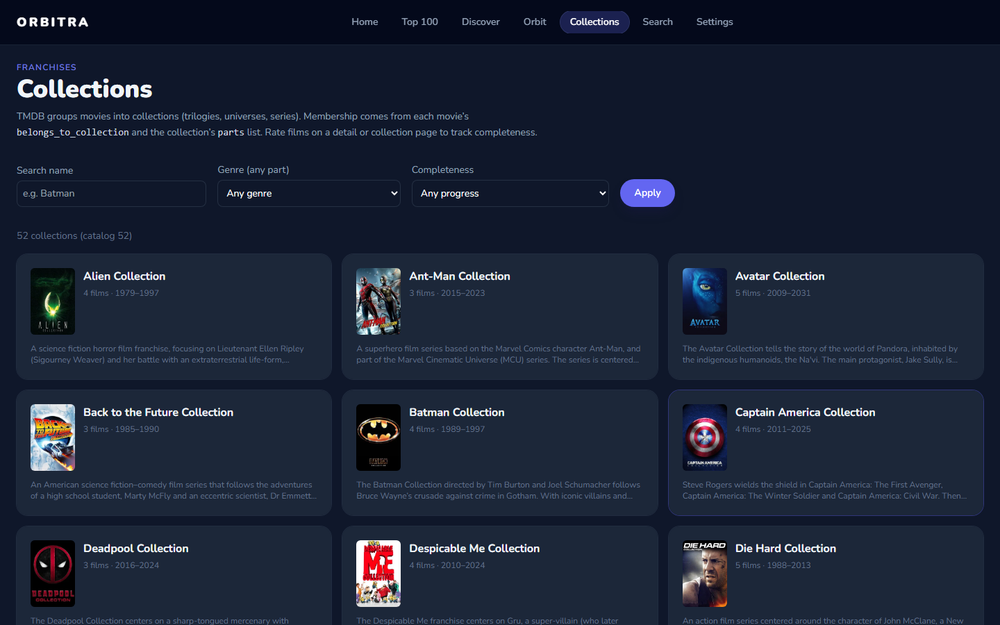
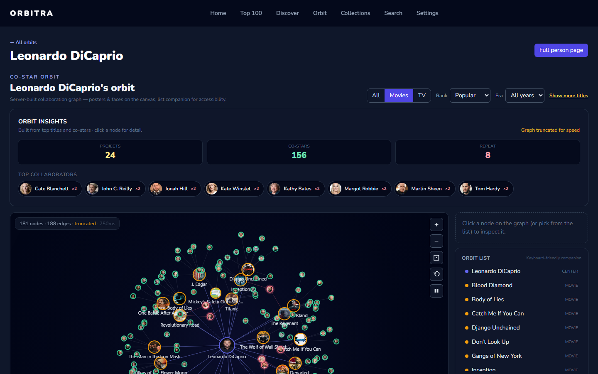
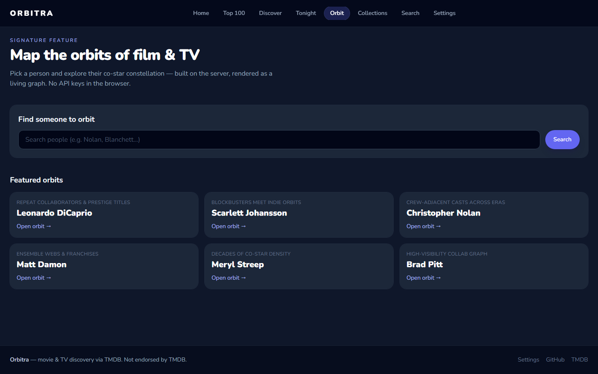

# Orbitra

**Map the orbits of film & television.**

Open-source movie and TV discovery — [Nuxt 4](https://nuxt.com/), [Tailwind CSS](https://tailwindcss.com/), [TMDB](https://www.themoviedb.org/). Built as a public portfolio repo: practical browsing plus a signature **co-star orbit graph**.

[](https://github.com/bjarkeef/orbitra/actions/workflows/ci.yml)
[](./LICENSE)
[](https://orbitra-livid.vercel.app)

**Live demo:** [orbitra-livid.vercel.app](https://orbitra-livid.vercel.app)

<p align="center">
  
</p>

<p align="center">
  
</p>

<p align="center">
  <a href="https://orbitra-livid.vercel.app/orbit/6193"><strong>Try a shareable orbit</strong></a>
  · Leonardo DiCaprio · filters and selection live in the URL
</p>

---

## Why Orbitra?

Most TMDB portfolio apps put the API key in the browser and stop at posters and search. Orbitra is built around a clearer story:

1. **Server-only TMDB access** — the browser never sees `TMDB_API`; every call goes through Nitro.
2. **Orbit graph** — open a person (or start from `/orbit`) and explore their co-star constellation. Topology is built **on the server**; the canvas only renders. **Share the URL** (filters + selected node). Physics motion is **opt-in** (off by default).
3. **Practical discovery** — region-aware watch providers, genre-aware Discover, **Tonight** mood and time-budget picks, collections with local ratings, and rich person and title pages.

No accounts, no synced watchlists — simple and self-contained.

---

## What you can do

| Area | Highlights |
|------|------------|
| **Home** | Hero, Orbit spotlight, trending / popular / upcoming / on-the-air rails |
| **Orbit** | Dedicated entry at `/orbit`, full-page graphs at `/orbit/:id`, person-page Orbit tab |
| **Tonight** | Mood + time-budget presets → TMDB discover with sensible defaults |
| **Discover** | Streaming service, monetization type, genres, and watch region |
| **Search** | Debounced multi-search (movies, TV, people); optional “on my services” filter |
| **Top 100** | Top-rated movie and TV charts |
| **Collections** | Franchise browse, watch order, **local** star ratings (browser storage) |
| **Title pages** | Overview, cast, where-to-watch, trailers, recommended + similar rails |
| **Person pages** | Bio, birthplace map, career timeline, role breakdown, social / IMDb links |
| **Settings** | Watch region for providers and Discover |

Signature path: person → **Orbit** → co-star network without N+1 browser calls to TMDB. Use **Share link** to copy filters and selection.

---

## Architecture



```
Browser  →  Nuxt 4 (Vue 3)  →  Nitro routes
                              ├─ /api/tmdb/*            proxy (API key never leaves the server; include_adult always false)
                              ├─ /api/actors/:id/graph  builds orbit nodes/edges (+ cache)
                              └─ /api/collections       curated franchise catalog
```

- Client data access is centralized in [`composables/useTmdb.ts`](./composables/useTmdb.ts).
- The proxy strips client `api_key` / `include_adult` and forces mainstream catalogue defaults.
- Orbit layout lives in `utils/orbitSim.ts`; the canvas stays render-focused in `components/actor/ActorGraph.vue`.

### Screenshots

| Home | Discover |
|:----:|:--------:|
|  |  |
| **Search** | **Movie detail** |
|  |  |
| **Person** | **Collections** |
|  |  |
| **Orbit graph** | **Orbit filters** |
|  |  |
| **Orbit index** | |
|  | |

Regenerate after UI changes (app must be running on port 3000):

```bash
npx playwright install chromium   # once, if needed
npm run build && node .output/server/index.mjs   # other terminal
npm run capture:screenshots
```

### Design decisions

- **TMDB key stays on the server** — safer defaults for a public demo and any fork.
- **Graph topology is server-built** — fewer round-trips, consistent rate and cache behavior.
- **Local-only ratings** — no OAuth or TMDB user sessions by choice.
- **Mainstream catalogue only** — proxy always forces `include_adult=false`.
- **npm + lockfile only** — reproducible installs (`package-lock.json`).

---

## Quick start

Requirements: **Node.js ≥ 20.19** (CI uses Node 22). Free [TMDB API key](https://www.themoviedb.org/settings/api) (v3 key is fine).

```bash
npm install
cp .env.example .env   # set TMDB_API=your_key
npm run dev            # http://localhost:3000
```

**Use npm only** — this repo ships `package-lock.json`. Don’t add yarn or pnpm lockfiles.

```bash
npm run lint
npm run typecheck
npm run knip
npm run build
npm run preview
```

Optional orbit checks:

```bash
npm run test:orbit
npm run test:orbit:visual   # needs a running app
```

CI runs prepare → lint → knip → typecheck → build on `main` (see [`.github/workflows/ci.yml`](./.github/workflows/ci.yml)).

### Deploy (e.g. Vercel)

1. Import the repo and use the Nuxt preset (or default Node build).
2. Set **`TMDB_API`** in the host environment (server-only — never `NUXT_PUBLIC_*`).
3. Deploy. The live demo uses the same pattern.

---

## Project layout

| Path | Role |
|------|------|
| `pages/` | File-based routes (home, discover, tonight, orbit, search, movie/TV/person, settings) |
| `components/` | UI, rails, posters, orbit stage / filters / insights |
| `composables/` | TMDB client, watch region, local ratings |
| `server/api/` | Nitro proxy, graph builder, collections catalog |
| `utils/orbitSim.ts` | Force layout for the orbit canvas |
| `utils/personCredits.ts` | Credit aggregation for person timelines |
| `ROADMAP.md` | What’s done and what’s next |
| `CONTRIBUTING.md` | How to propose changes |

---

## Contributing

Issues and focused PRs welcome. Prefer small changes that match existing patterns (proxy-only TMDB, Tailwind tokens in `assets/css/main.css`, TypeScript in Vue SFCs).

See [CONTRIBUTING.md](./CONTRIBUTING.md), [CODE_OF_CONDUCT.md](./CODE_OF_CONDUCT.md), [SECURITY.md](./SECURITY.md), and [ROADMAP.md](./ROADMAP.md).

---

## Security

Please report vulnerabilities privately — see [SECURITY.md](./SECURITY.md). Never open a public issue that includes secrets or a working exploit.

---

## License

[MIT](./LICENSE).

---

## Attribution

This product uses the TMDB API but is **not** endorsed or certified by TMDB.  
Streaming availability is supplied through TMDB and attributed to [JustWatch](https://www.justwatch.com/) where shown.
